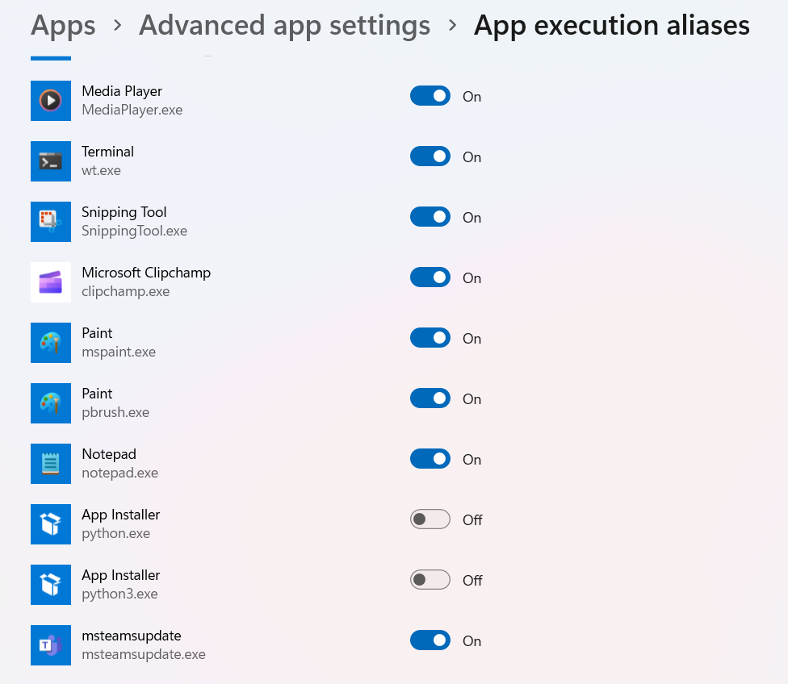
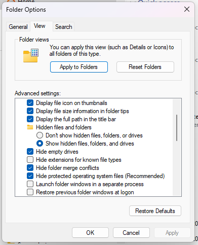
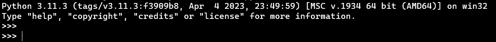

# Environment Setup

## Overview of Command Line Interfaces
- [Windows Commands](https://learn.microsoft.com/en-us/windows-server/administration/windows-commands/windows-commands)

A command-line interface (CLI) is a simple window where you type commands instead of clicking buttons. Think of it like talking to your computer in short, clear sentences: “go to this folder,” “list files,” or “run this Python script.” It’s super useful for Python because you can quickly start the Python interpreter, run code files, and automate repetitive tasks. While it looks plain at first, it’s fast, predictable, and the same commands work on any computer, which makes learning, sharing instructions, and troubleshooting much easier.

Windows has two command-line shells: the **Command shell** and **PowerShell**. Each shell is a software program that provides direct communication between you and the operating system or application, providing an environment to automate it operations.
- The **Command shell** was the first shell built into Windows to automate routine tasks, like user account management or nightly backups, with batch (.bat) files. With Windows Script Host, you could run more sophisticated scripts in the Command shell.
- **PowerShell** was designed to extend the capabilities of the Command shell to run PowerShell commands called cmdlets. Cmdlets are similar to Windows Commands but provide a more extensible scripting language. You can run both Windows Commands and PowerShell cmdlets in PowerShell, but the Command shell can only run Windows Commands and not PowerShell cmdlets.

Windows has created a new, open-source **Windows Terminal** to be a universal console host. It acts as an interface to multiple shells, allowing you to start the Command Prompt, PowerShell, and any other shell that you might have available as different tabs in the same host.

The Windows Terminal is a modern, fast, efficient, powerful, and productive terminal application for users of command-line tools and shells like Command Prompt, PowerShell, and WSL. Its main features include multiple tabs, panes, Unicode and UTF-8 character support, a GPU accelerated text rendering engine, and custom themes, styles, and configurations.
- Download the Windows Terminal from the [Microsoft Store](https://apps.microsoft.com/store/detail/windows-terminal/9N0DX20HK701)

Installing it from the Microsoft Store has a few advantages. One advantage is that it ensures that updates come automatically. Another advantage is that it’s painless to install. 

## Windows prerequisites

### App Execution Aliases
App execution aliases are a special kind of alias for Windows. For example, if you type python on the command line, Windows will automatically ask you if you want to install the Microsoft Store version of Python.

App execution aliases are a feature to make things easier to get started, but they can interfere with other programs. For instance, when you install pyenv for Windows and install a few Python versions, the app execution aliases will interfere by not allowing you to access those Python versions.

You can search for the app execution alias control panel from the Start menu. The entry is called *Manage app execution aliases*.



You can usually turn all of these off, as you already have the Path environment variable to make sure apps are available on the command line.

### Windows Explorer
In an attempt to make Windows Explorer easier to use for non-developer types, it hides some information that you’ll probably want to see, so you should enable the following:
- Show file extensions
- Show hidden files
- Show protected operating system files
- Show the full path in the title bar

You can access these options from the file explorer, which you can open with `Win+E`, click on the File tab in the top left, and choose *Change folder and search options*. Under the View tab, you’ll be able to find these settings.



### Loosening Your Execution Policy

First open up Windows Terminal as an administrator.

> Note: To launch programs as an administrator, you can search for the app in the Start menu, and then right-click on it, and choose Run as administrator.

Once you have an administrator terminal session open, you should be presented with a PowerShell tab.

The execution policy sets how strict your system is about running scripts from other sources. For this tutorial, you’ll want to set it to `RemoteSigned`:
- `Set-ExecutionPolicy RemoteSigned`

You may not see the warning, because the execution policy might already be set. To double-check your setting, you can run `Get-ExecutionPolicy`.

> Without administrator privileges: `Set-ExecutionPolicy -ExecutionPolicy RemoteSigned -Scope CurrentUser`

## Overview of Python Installation methods
- [Using Python on Windows](https://docs.python.org/3/using/windows.html)
- [Your Python Coding Environment on Windows: Setup Guide](https://realpython.com/python-coding-setup-windows/#setting-up-core-python-coding-software-in-windows)

Unlike most Unix systems and services, **Windows does not include a system supported installation of Python**.

There are a number of different methods available for Windows, each with certain benefits and downsides:
- The **full installer** contains all components and is the best option for developers using Python for any kind of project. Download the installer from the [official Python download page](https://www.python.org/downloads/).
- The **Microsoft Store package** is a simple installation of Python that is suitable for running scripts and packages, and using IDLE or other development environments. It requires Windows 10 and above, but can be safely installed without corrupting other programs. It also provides many convenient commands for launching Python and its tools
- Install using the **[pyenv](https://github.com/pyenv-win/pyenv-win)** tool. pyenv is a simple python version management tool. It lets you easily switch between multiple versions of Python. It's simple, unobtrusive, and follows the UNIX tradition of single-purpose tools that do one thing well.
- Install using the **[uv](https://docs.astral.sh/uv/)** tool. uv is a modern Python version management tool that simplifies the process of managing multiple Python installations.

## Installing Python using UV
- [Managing Python Projects With uv: An All-in-One Solution](https://realpython.com/python-uv/)

The uv tool is a high-speed package and project manager for Python. It’s written in Rust and designed to streamline your workflow. It offers fast dependency installation and integrates various functionalities into a single tool.

With uv, you can install and manage multiple Python versions, create virtual environments, efficiently handle project dependencies, reproduce working environments, and even build and publish a project. These capabilities make uv an all-in-one tool for Python project management.

Install uv with our official standalone installer:
- Windows: `powershell -ExecutionPolicy ByPass -c "irm https://astral.sh/uv/install.ps1 | iex"`
- macOS/Linux: `curl -LsSf https://astral.sh/uv/install.sh | sh`
- Optional: [Shell autocompletion](https://docs.astral.sh/uv/getting-started/installation/#shell-autocompletion)

> **Upgrading uv**: When uv is installed via the standalone installer, it can update itself on-demand: `uv self update`

**Installing a specific Python version:**
- Create a new folder for the course and navigate into it.
- Run the command: `uv python install 3.14`
- Create a new environment with the installed Python version: `uv venv --python 3.14`
- When needed, activate the virtual environment: `.venv\Scripts\activate` on Windows or `source .venv/bin/activate` on macOS/Linux.
- Run `python --version` to verify the correct Python version is active.

## Python shell and running your first Python script
- [How to Run Your Python Scripts](https://realpython.com/run-python-scripts/)
- [The Interpreter, an Interactive Shell](https://python-course.eu/python-tutorial/interpreter-interactive-shell.php)
- [Interacting With Python](https://realpython.com/interacting-with-python/)

To start the Python shell, open the Command Prompt and run `python` or `py`. You should see the Python shell open with the version number printed to the screen.

When commands are read from a tty, the interpreter is said to be in interactive mode. In this mode it prompts for the next command with the primary prompt, usually three greater-than signs (>>>); for continuation lines it prompts with the secondary prompt, by default three dots (...). The interpreter prints a welcome message stating its version number and a copyright notice before printing the first prompt:



Now you can type Python commands into the shell. A simple command like `print("Hello World!")` will print the text `Hello World!` to the screen.


When you work interactively, every expression and statement you type in is **evaluated and executed immediately**.

An interactive session will allow you to test every piece of code you write, which makes it an awesome development tool and an excellent place to experiment with the language and test Python code on the fly.

> Note: The first rule of thumb to remember when using Python is that if you’re in doubt about what a piece of Python code does, then launch an interactive session and try it out to see what happens.

Typing an end-of-file character (Control-D on Unix, `Control-Z` on Windows) at the primary prompt causes the interpreter to exit with a zero exit status. If that doesn’t work, you can exit the interpreter by typing the following command: `exit`.

A Python interactive session will allow you to write a lot of lines of code, but once you close the session, you lose everything you’ve written. That’s why the usual way of writing Python programs is by using plain text files. By convention, those files will use the `.py` extension. 

A plain text file containing Python code that is intended to be directly executed by the user is usually called **script**, which is an informal term that means top-level program file.

Save the file in your working directory with the name `hello.py`:

```python
print("Hello World!")
```

The most basic and easy way to run a Python script is by using the python command. You need to open a command line and type the word python followed by the path to your script file like this: `python hello.py` Hello World! Then you hit the ENTER button from the keyboard, and that's it. On the other hand, a plain text file, which contains Python code that is designed to be imported and used from another Python file, is called **module**.

So, the main difference between a module and a script is that **modules are meant to be imported**, while **scripts are made to be directly executed**.

## Overview of Integrated Development Environments

- [Python IDEs and Code Editors (Guide)](https://realpython.com/python-ides-code-editors-guide/)

An **IDE (or Integrated Development Environment)** is a program dedicated to software development. As the name implies, IDEs integrate several tools specifically designed for software development. These tools usually include:

- An editor designed to handle code (with, for example, syntax highlighting and auto-completion)
- Build, execution, and debugging tools
- Some form of source control

Most IDEs support many different programming languages and contain many more features. They can, therefore, be large and take time to download and install. You may also need advanced knowledge to use them properly.

In contrast, a dedicated **code editor** can be as simple as a text editor with syntax highlighting and code formatting capabilities. Most good code editors can execute code and control a debugger. The very best ones interact with source control systems as well. Compared to an IDE, a good dedicated code editor is usually smaller and quicker, but often less feature rich.

**Requirements for a Good Python Coding Environment**:

- **Save and reload code files**: If an IDE or editor won’t let you save your work and reopen everything later, in the same state it was in when you left, it’s not much of an IDE.
- **Run code from within the environment**: Similarly, if you have to drop out of the editor to run your Python code, then it’s not much more than a simple text editor.
- **Debugging support**: Being able to step through your code as it runs is a core feature of all IDEs and most good code editors.
- **Syntax highlighting**: Being able to quickly spot keywords, variables, and symbols in your code makes reading and understanding code much easier.
- **Automatic code formatting**: Any editor or IDE worth it’s salt will recognize the colon at the end of a while or for statement, and know the next line should be indented.

**General Editors and IDEs with Python Support**:

- [Visual Studio Code](https://code.visualstudio.com/): Not to be confused with full Visual Studio, Visual Studio Code (aka VS Code) is a full-featured code editor available for Linux, Mac OS X, and Windows platforms. Small and light-weight, but full-featured, VS Code is open-source, extensible, and configurable for almost any task.
- [PyCharm](https://www.jetbrains.com/pycharm/): One of the best (and only) full-featured, dedicated IDEs for Python is PyCharm. Available in both paid (Professional) and free open-source (Community) editions, PyCharm installs quickly and easily on Windows, Mac OS X, and Linux platforms.
- [Sublime Text](http://www.sublimetext.com/): Written by a Google engineer with a dream for a better text editor, Sublime Text is an extremely popular code editor. Supported on all platforms, Sublime Text has built-in support for Python code editing and a rich set of extensions (called packages) that extend the syntax and editing features.
- [Atom](https://atom.io/): Available on all platforms, Atom is billed as the “hackable text editor for the 21st Century.” With a sleek interface, file system browser, and marketplace for extensions, open-source Atom is built using Electron, a framework for creating desktop applications using JavaScript, HTML, and CSS. Python language support is provided by an extension that can be installed when Atom is running.

## Installing and running VSCode

- [Python Development in Visual Studio Code](https://realpython.com/python-development-visual-studio-code/)
- [Setting Up VS Code](https://realpython.com/python-coding-setup-windows/#setting-up-vs-code)
- [Advanced Visual Studio Code for Python Developers](https://realpython.com/advanced-visual-studio-code-python/)
- [Setting Up VSCode For Python: A Complete Guide](https://www.datacamp.com/tutorial/setting-up-vscode-python)
- [Getting Started with Python in VS Code](https://code.visualstudio.com/docs/python/python-tutorial)

Visual Studio Code is a lightweight but powerful source code editor which runs on your desktop and is available for Windows, macOS and Linux. It comes with built-in support for JavaScript, TypeScript and Node.js and has a rich ecosystem of extensions for other languages and runtimes (such as C++, C#, Java, Python, PHP, Go, .NET).

[Download Visual Studio Code](https://code.visualstudio.com/Download) and install it on your computer.

At its heart, Visual Studio Code is a code editor. Like many other code editors, VS Code adopts a common user interface and layout of an explorer on the left, showing all of the files and folders you have access to, and an editor on the right, showing the content of the files you have opened.


By starting VS Code in a folder, that folder becomes your "workspace".

Using a command prompt or terminal navigate into the course folder and open it in VS Code by entering the following commands:

```
mkdir python-beginner-course
cd python-beginner-course
code .
```

Install the dependencies in the activated virtual environment: `uv pip install ruff`

> Alternately, you can create a folder through the operating system UI, then use VS Code's File > Open Folder to open the project folder.

Install the **Python extension for Visual Studio Code** from the [Visual Studio Marketplace](https://marketplace.visualstudio.com/items?itemName=ms-python.python).
- [Python](https://marketplace.visualstudio.com/items?itemName=ms-python.python)
- [Pylance](https://marketplace.visualstudio.com/items?itemName=ms-python.vscode-pylance)
- [Ruff](https://marketplace.visualstudio.com/items?itemName=charliermarsh.ruff)
- [Code Spell Checker](https://marketplace.visualstudio.com/items?itemName=streetsidesoftware.code-spell-checker)


Open the Command Palette (`Ctrl+Shift+P`), start typing `Python: Select Interpreter` command from the Command Palette. Select the local Python interpreter installed previously (ex. `(venv-name) Python 3.14.0`).

Create a `.vscode` folder in the project root. In the new folder create a file `settings.json`:
```json
{
    "python.languageServer": "Pylance",
    "python.analysis.typeCheckingMode": "basic",
    "python.analysis.diagnosticMode": "workspace",
    "editor.formatOnSave": true,
    "editor.defaultFormatter": "charliermarsh.ruff",
    "editor.tabSize": 4,
    "editor.codeActionsOnSave": {
        "source.organizeImports.ruff": "explicit",
        "source.addMissingImports": "explicit",
        "source.formatDocument.ruff": "explicit",
        "source.fixAll.ruff": "explicit"
    },
    "ruff.importStrategy": "fromEnvironment",
    "ruff.lint.select": ["ALL"],
    "ruff.lineLength": 180,
    "ruff.lint.ignore": ["S105"],
    "ruff.exclude": ["**/tests/**"],
    "python.testing.pytestArgs": [
        "tests"
    ],
    "python.testing.unittestEnabled": false,
    "python.testing.pytestEnabled": true,
    "cSpell.words": [
        "pyenv"
    ]
}
```

Restart the VS Code to make sure all settings are applied.

From the File Explorer toolbar, select the New File button and name the file `hello.py`, and VS Code will automatically open it in the editor.

Now that you have a code file in your Workspace, enter the following source code in `hello.py`:
```python
msg = "Roll a dice"
print(msg)
```
When you start typing print, notice how IntelliSense presents auto-completion options.

Try to save the file `hello.py` and see what happens. The Python extension automatically formats the code according to PEP 8 standards.

Click the **Run Python File in Terminal** play button in the top-right side of the editor.

> [Keyboard shortcuts for Windows](https://code.visualstudio.com/shortcuts/keyboard-shortcuts-windows.pdf)
