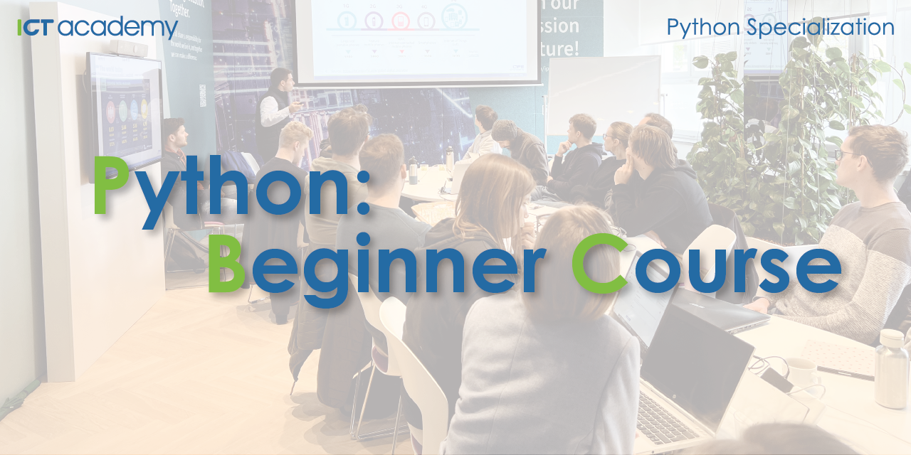

# Python Specialization: Beginner Course

  

    <em>This course introduces the basics of Python. Develop practical programming skills through hands-on projects.</em>

---

**Live on-site course**: <a href="https://ict-academy.si/usposabljanje/python-osnovni-tecaj/" target="_blank">https://ict-academy.si/usposabljanje/python-osnovni-tecaj/</a>

**All courses**: <a href="https://ict-academy.si/" target="_blank">https://ict-academy.si/</a>

---

**What you'll learn**:
- Introduction to the Python Ecosystem

## Prerequisites
- No prior programming experience required

## Full Course Outline

### [Part 1: Introduction to the Python Ecosystem](./Part_01_Introduction_to_the_Python_Ecosystem/README.md)
- How Does a Program Work on a Computer?
- Introduction to Programming Languages
- Overview of Basic Concepts
- Introduction to Python
- Introduction to Python Documentation and Resources for Self-Study

### [Part 2: Environment Setup](./Part_02_Environment_Setup/README.md)
- Overview of Command Line Interfaces
- Windows prerequisites
- Overview of Python Installation methods
- Installing Python using UV
- Python shell and running your first Python script
- Overview of Integrated Development Environments
- Installing and running VSCode

### [Part 3: Python Basics](./Part_03_Python_Basics/README.md)
- Basic Data Types
- Printing to the Console
- Variables
- Getting values from users
- Operators and Expressions
- String formatting

## Changes
- Version `v1.0.0`: X.11.2025 - Initial release.